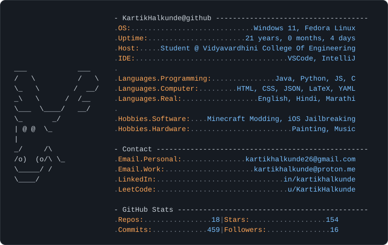

```bash
> fastfetch
```

<picture>
  <source media="(prefers-color-scheme: dark)" srcset="assets/fastfetch-dark.svg">
  <source media="(prefers-color-scheme: light)" srcset="assets/fastfetch-light.svg">
  
</picture>

<p align="center">
  <a href="mailto:kartikhalkunde@proton.me"></a>
  <a href="https://kartikrashmin.me/"></a>
  <a href="https://www.linkedin.com/in/kartikrashmin/"></a>
  <a href="https://leetcode.com/u/KartikRashmin/"></a>
</p>

<picture>
  <source media="(prefers-color-scheme: dark)" srcset="https://raw.githubusercontent.com/KartikHalkunde/KartikRashmin/output/github-snake-dark.svg">
  <source media="(prefers-color-scheme: light)" srcset="https://raw.githubusercontent.com/KartikHalkunde/KartikRashmin/output/github-snake.svg">
  
</picture>
